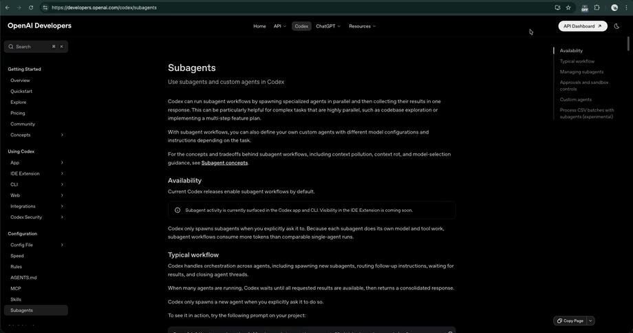

# Instant Page Highlighter

A minimal Chrome extension that lets users highlight text by simply selecting it.

No extra click flow. No bloated UI. Toggle the mode on, select text, and it is highlighted instantly.

## Why This Exists

Most web highlighters waste time with unnecessary interaction:

- Select text
- Open a menu
- Click highlight
- Repeat forever

This extension removes that friction.

When highlight mode is enabled, text selection becomes the trigger. That is the whole point.

## Features

- Toggle highlight mode on or off from the Chrome toolbar
- Highlight text instantly on selection
- Default highlight color: light green
- Smooth, minimal visual styling
- Contrast-aware text rendering for better readability on light and dark pages
- Double-click or double-tap a highlight to remove it
- Persistent highlights stored per page using `chrome.storage.local`
- Simple Manifest V3 architecture

## Demo Behavior

1. Click the extension icon to enable highlight mode
2. Select any text on a webpage
3. The selected text is highlighted automatically
4. Reload the page and the highlight remains
5. Double-click or double-tap a highlight to remove it

## Installation

### Load Unpacked

This is the most reliable way to install it locally during development.

1. Open `chrome://extensions/`
2. Enable **Developer mode**
3. Click **Load unpacked**
4. Select the extension folder: `instant-page-highlighter`

### More options

More options or published ones will be available when there's a demand.

## Storage Strategy

This project intentionally avoids unnecessary complexity.

- No backend
- No account system
- No sync layer
- No database

Highlights are stored locally with `chrome.storage.local`, keyed per page URL.

That makes the extension lightweight, fast, and easy to reason about.
